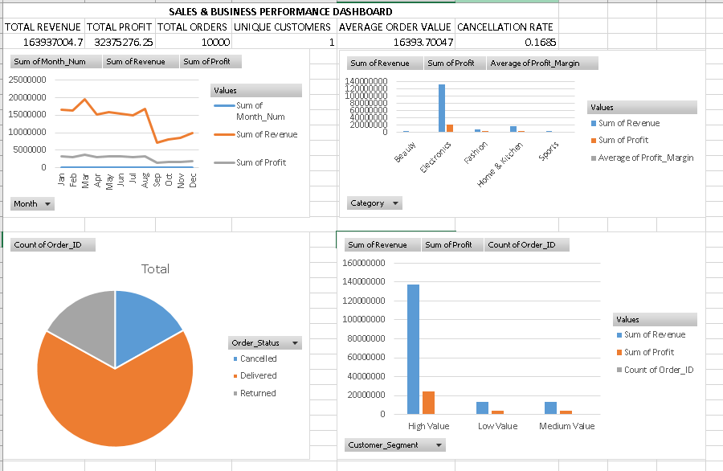

# Excel Sales Business Analysis

## Project Overview

This project analyzes a 10,000-record sales dataset using Microsoft Excel.

The objective of the project is to transform raw sales data into meaningful business insights using data cleaning, calculated fields, KPI analysis, PivotTables, charts, and an interactive dashboard.

## Tools Used

- Microsoft Excel
- Excel Tables
- Excel Formulas
- PivotTables
- PivotCharts
- Conditional Formatting
- Data Cleaning
- Business Analysis

## Project Workflow

Raw Data
↓
Data Cleaning
↓
Data Transformation
↓
KPI Analysis
↓
PivotTable Analysis
↓
Charts
↓
Business Dashboard

## Data Cleaning

The dataset was cleaned by:

- Removing duplicate records
- Handling missing City values
- Handling missing Customer Ratings
- Standardizing data
- Checking data consistency

## Calculated Fields

The following calculated fields were created:

- Revenue
- Cost Factor
- Cost
- Profit
- Profit Margin
- Month
- Month Number
- Year
- Customer Segment
- Customer Unique Flag

## KPI Analysis

The project calculates:

- Total Revenue
- Total Profit
- Total Orders
- Total Units Sold
- Unique Customers
- Average Order Value
- Cancellation Rate
- Return Rate
- Average Customer Rating
- Average Delivery Days

## Business Analysis

PivotTables were used to analyze:

- Revenue by Region
- Revenue by City
- Revenue by Category
- Monthly Revenue Trends
- Customer Segments
- Order Status
- Payment Methods
- Delivery Performance
- Customer Ratings

## Dashboard

The final dashboard provides a visual summary of sales and business performance.

## Project Outcome

This project demonstrates practical Business Analyst skills including:

- Data cleaning
- Excel data transformation
- KPI development
- Exploratory data analysis
- PivotTable analysis
- Data visualization
- Dashboard development # E-Commerce-Sales-Customer-Analytics-Dashboard-Microsoft-Excel
Business analysis of sales data using Microsoft Excel, including data cleaning, KPI analysis, PivotTables, charts and a dashboard.
